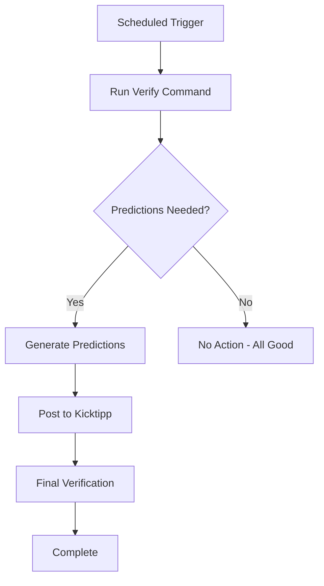

# GitHub Actions Setup Guide

This guide helps you configure the automated matchday predictions workflow for your KicktippAi repository.

## 🚀 Quick Setup

### 1. Configure Repository Secrets

Go to your GitHub repository → Settings → Secrets and variables → Actions, then add these secrets:

#### Required Secrets

| Secret Name | Description | Example |
|-------------|-------------|---------|
| `KICKTIPP_USERNAME` | Your Kicktipp login username | `your-username` |
| `KICKTIPP_PASSWORD` | Your Kicktipp login password | `your-password` |
| `FIREBASE_PROJECT_ID` | Your Firebase project ID | `kicktipp-ai-12345` |
| `FIREBASE_SERVICE_ACCOUNT_JSON` | Firebase service account JSON (entire file content) | `{"type": "service_account", ...}` |
| `OPENAI_API_KEY` | Your OpenAI API key | `sk-...` |

### 2. Verify Workflow Files

Ensure these files exist in your repository:
- `.github/workflows/automated-predictions.yml` ✅
- `.github/workflows/build.yml` ✅

### 3. Test the Setup

#### Option A: Manual Test
1. Go to Actions tab in your GitHub repository
2. Click "Automated Matchday Predictions" workflow
3. Click "Run workflow"
4. Select a model (e.g., "o4-mini")
5. Click "Run workflow"

#### Option B: Local Test
```bash
# Test locally with environment variables set
dotnet run --project src/Orchestrator/Orchestrator.csproj -- verify --init-matchday --agent
```

## 📅 Schedule Details

The workflow runs automatically:
- **00:00 Europe/Berlin** (Midnight)
- **12:00 Europe/Berlin** (Noon)

> **Note**: GitHub Actions uses UTC, so times may shift slightly during DST transitions.

## 🔍 How It Works



## 🛠️ Troubleshooting

### Common Issues

#### 1. Workflow Fails - Authentication Error
```
Error: Kicktipp authentication failed
```
**Solution**: Verify `KICKTIPP_USERNAME` and `KICKTIPP_PASSWORD` secrets

#### 2. Workflow Fails - Firebase Error
```
Error: Database not configured
```
**Solution**: Check `FIREBASE_PROJECT_ID` and `FIREBASE_SERVICE_ACCOUNT_JSON` secrets

#### 3. Workflow Fails - OpenAI Error
```
Error: OpenAI API key invalid
```
**Solution**: Verify `OPENAI_API_KEY` secret and check API quota

### Checking Workflow Status

1. Go to your repository's **Actions** tab
2. Click on the latest "Automated Matchday Predictions" run
3. Review the logs for any errors
4. Check the workflow summary at the bottom

### Emergency Manual Override

If the automation fails, you can run predictions manually:

```bash
# Generate predictions for current matchday
dotnet run --project src/Orchestrator/Orchestrator.csproj -- matchday o4-mini --override-kicktipp --verbose

# Verify they were posted correctly
dotnet run --project src/Orchestrator/Orchestrator.csproj -- verify --agent
```

## 🎯 Customization

### Change Model Default
Edit `.github/workflows/automated-predictions.yml`:
```yaml
env:
  DEFAULT_MODEL: 'gpt-4o-2024-08-06'  # Change this
```

### Change Schedule
Edit the cron expressions in the workflow:
```yaml
schedule:
  - cron: '0 6 * * *'   # 06:00 UTC = Different time
  - cron: '0 18 * * *'  # 18:00 UTC = Different time
```

### Add Notifications
You can extend the workflow to send notifications to Slack, Discord, or email when predictions are generated.

## 📊 Monitoring

The workflow creates detailed summaries for each run, including:
- Trigger type and timing
- Model used
- Verification results
- Actions taken
- Any errors encountered

Access these in the Actions tab → Workflow run → Summary section.

## 🔒 Security Notes

- All sensitive data is stored in GitHub Secrets (encrypted)
- Secrets are only accessible to the workflow during execution
- API keys and passwords are never exposed in logs
- Firebase service account should have minimal required permissions

## ✅ Verification Checklist

- [ ] All 5 repository secrets configured
- [ ] Workflow files committed to repository
- [ ] Manual test run successful
- [ ] Build workflow passes
- [ ] Local environment works (optional but recommended)

## 🆘 Support

If you encounter issues:
1. Check the workflow logs in the Actions tab
2. Verify all secrets are properly configured
3. Test the commands locally with your environment
4. Check API service status (OpenAI, Firebase, Kicktipp)

The automation is designed to be resilient - it will retry on the next scheduled run if there are temporary issues.
