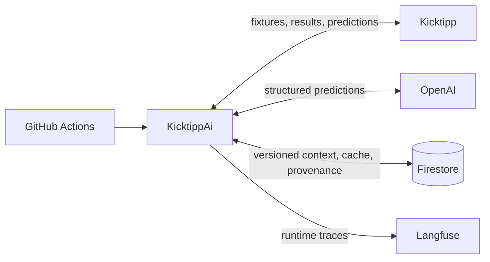
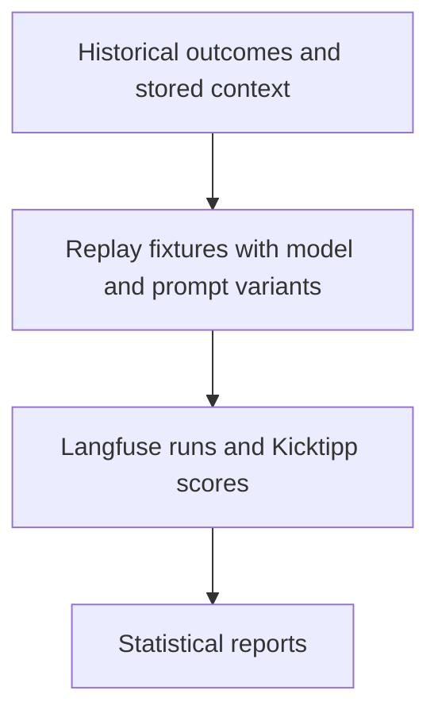

# KicktippAi 🤖⚽

> **About this README:** This introduction was refreshed in August 2026 from an interview with the project owner and a repository-wide review of the implementation. The motivation and priorities reflect that conversation; the final text was drafted with Codex.

*What happens when an LLM joins a real football prediction game?*

KicktippAi is a personal hobby project that runs autonomous AI participants in [Kicktipp](https://www.kicktipp.de/). It gathers football context, asks OpenAI models for score and bonus-question predictions, submits those predictions to real Kicktipp communities, and observes the results over the course of a competition.

The project exists to explore what is possible with AI-powered systems on something concrete, long-running, and fun. It is also a way to follow the evolution of LLMs, evaluation and observability tooling, and coding agents through a system that genuinely gets used. KicktippAi is tailored to its own communities and experiments rather than presented as a turnkey prediction service.

## How it works

### Autonomous operations

GitHub Actions runs the operational workflows for each active competition and participant. KicktippAi reads the current fixtures and results, assembles the appropriate competition and community context, reuses a valid stored prediction when it can, and asks the configured OpenAI model for a new structured prediction when it must. It persists the prediction before submission, posts it to Kicktipp, and verifies the result afterwards.

The context is deliberately specific to the competition and prediction. Depending on the route, it can include standings, community scoring rules, recent results, home/away and head-to-head history, rosters, club Elo ratings, FIFA rankings, or lineups. These are examples of the current system, not a fixed recipe: context design is continually adjusted as new competitions expose different needs and experiments suggest better inputs.

Firestore provides more than storage. Versioned context, prediction identity, immutable provenance, and a bounded reprediction history let the system decide whether an existing prediction remains usable. Compatible communities can reuse a reference prediction without another model call; arena participants and other configurations can remain self-contained. Langfuse records prompt identity, model configuration, token usage, cost, and traces for later inspection.

Operational automation has been part of KicktippAi from the beginning. The system has so far run across Bundesliga 2025/26, the 2026 FIFA World Cup, and Bundesliga 2026/27 without requiring manual prediction posting.

### Experiments on demand

Experiments are a separate capability, not a step in every live prediction cycle. They are run when a production decision needs evidence or when a question about model behavior is interesting in its own right.

Historical fixtures can be sampled, repeated many times, or combined into repeated-match slices. Every configuration sees the same reconstructable fixture context and is scored under the real community rules. Comparable Langfuse runs can then be exported into statistical reports with paired comparisons, uncertainty estimates, and explicit provenance.

This machinery has supported comparisons such as `o3` versus GPT-5.5, experiments around model knowledge cutoffs, and the GPT-5.6 production-candidate study used for the current Bundesliga configuration. The [published experiment reports](https://ehonda.github.io/KicktippAi/experiment-analysis/) expose the results rather than reducing them to permanent claims about a single “best” model.

## Current chapter: Bundesliga 2026/27

As of August 2026, the production configuration is `gpt-5.6-sol` with `xhigh` reasoning. The choice was informed by a reproducible comparison over completed, knowledge-cutoff-safe Bundesliga 2025/26 fixtures; its descriptive ranking and the statistical caveats are preserved in the [full production-candidate report](https://ehonda.github.io/KicktippAi/experiment-analysis/repeated-match-slices/pes-squad/all-matchdays-after-20260217t230000z/random-10x20-seed-20260821-gpt-5-6-production-candidate-quality/gpt-5-6-production-candidate-quality-plus-sol-max-2026-08-26t22-24-45z.analysis.report.html).

The production stream runs alongside alternative configurations in `ehonda-ai-arena`. Bundesliga context now includes richer roster information and club Elo ratings, adapting ideas learned from the World Cup ranking and lineup context while remaining specific to the domestic competition. The current design is a checkpoint in an ongoing learning process, not a finished formula for football prediction.

## Three competition chapters

- **Bundesliga 2025/26** established the autonomous operating model, community-specific predictions, and the AI arena.
- **FIFA World Cup 2026** tested the system against a very different tournament and introduced competition-specific adaptations such as FIFA rankings and lineup context.
- **Bundesliga 2026/27** brings those lessons back into a domestic season with stronger context, explicit provenance, reproducible model selection, and a requirements-led onboarding program.

## Built with coding agents

The prediction operation was autonomous from the outset. What changed most dramatically over the project's first year was how the project itself is developed. Coding agents now carry substantial work from requirements and plans through research, implementation, review, validation, and production onboarding.

The owner still supplies direction and ideas, makes consequential product and model decisions, authorizes spending, controls credentials, and handles external gates. Within those boundaries, a small concurrent team of agents can work through a planned body of engineering work with increasing autonomy. The [interactive analysis of the Bundesliga 2026/27 closeout](https://ehonda.github.io/KicktippAi/session-analysis/p0-closeout/) examines one such run in detail, including its task graph, agent activity, costs, interventions, discoveries, and repairs.

## Under the hood

- **.NET and C#** provide the command-line application, domain model, integrations, and operational logic.
- **GitHub Actions** schedules and coordinates context collection, prediction, posting, and verification.
- **OpenAI's Responses API** produces schema-constrained match and bonus predictions from hosted, versioned prompts.
- **Firestore** stores competition-scoped context, predictions, outcomes, and their provenance.
- **Langfuse** provides prompt management, tracing, usage visibility, datasets, and experiment runs.
- **Python statistical tooling** turns comparable experiment runs into JSON, Markdown, and browser-friendly reports.

## Explore further

- Browse all [published reports](https://ehonda.github.io/KicktippAi/), including experiment analysis and the engineering-session investigation.
- Read the [experiment methodology](docs/langfuse/experiments/README.md).
- See how the [automation workflows](.github/workflows/README.md) are composed and activated.
- Follow the [Bundesliga 2026/27 program](plans/bundesliga-2026-27/README.md) for the detailed requirements, decisions, and execution history behind the current chapter.

## License

See the [license](LICENSE).
