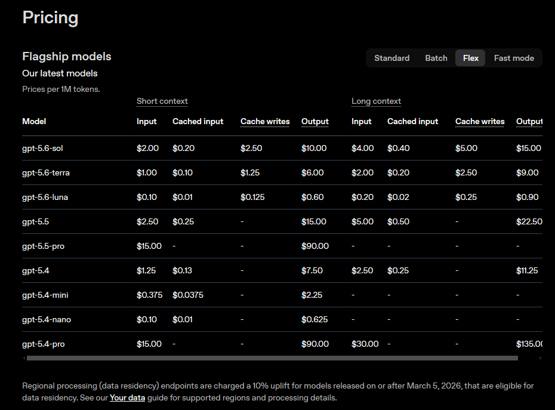
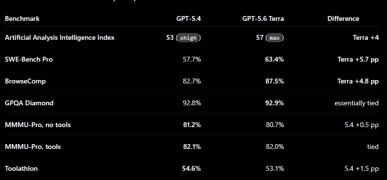
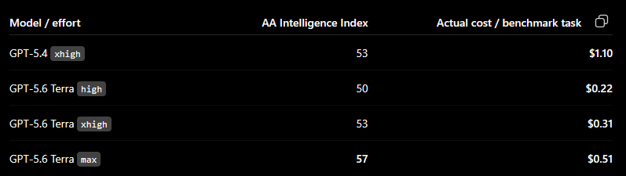

# GPT-5.6 Bundesliga 2025/26 production-candidate preregistration

**Status:** EVIDENCE COLLECTION COMPLETE — the original full-nine quality
surface could not complete Luna/`max`; eight original configurations and the
post-hoc Owner-added Sol/`xhigh` configuration completed. Owner selection is
pending.

**Verified:** 2026-08-26

This preregistration defines the P0-23 evidence program for the Bundesliga
2026/27 production-model and arena-participant decisions. It replaces the
superseded Terra/`medium`, Sol/`medium`, cap-`10000`, fixed-`15 × 20`, and
separate-phase-budget example with the owner's exact nine-row matrix, the
estimate-row-derived cap workflow, an adaptive paired quality design, and one
cumulative USD 30 ceiling.

USD 30 is a hard ceiling, not a spending target. The program should finish for
less whenever the evidence is sufficient. The authorized dataset sync,
preflights, failed Luna/`max` first-batch attempt, cap remediation, and accepted
cost rows created Langfuse dataset/run/trace/score state and model usage. They
did not mutate hosted-prompt content or labels, select a production model or
arena participant, post a community prediction, dispatch a production
workflow, or activate a schedule. Every paid cost action was separately
admitted through the cumulative Decimal gate. The final cost evidence is
reported in
[the cost-results report](gpt-5-6-bundesliga-2025-26-production-candidate-cost-results.md).
The execution outcome and exploratory statistical comparison are in the
[quality-results report](gpt-5-6-bundesliga-2025-26-production-candidate-quality-results.md).

Related planning and decisions:

- [P0-23 — GPT-5.6 production-candidate evidence](../../plans/bundesliga-2026-27/tasks/p0-23-gpt-5-6-production-candidate-evidence.md)
- [ADR-0006 — stage validation with a cheap test model](../../plans/bundesliga-2026-27/decisions/0006-stage-validation-with-a-cheap-test-model.md)
- [ADR-0033 — pin the validation-model ledger and reserve production selection](../../plans/bundesliga-2026-27/decisions/0033-pin-validation-model-ledger-and-reserve-production-selection.md)
- [ADR-0040 — hash-bound Bundesliga 2025/26 experiment compatibility](../../plans/bundesliga-2026-27/decisions/0040-use-hash-bound-2025-26-context-for-preseason-cost-experiments.md)
- [ADR-0043 — freeze historical aliases and the eligible pool](../../plans/bundesliga-2026-27/decisions/0043-freeze-historical-experiment-aliases-and-eligible-pool.md)
- [ADR-0046 — bind cost usage to exact Langfuse dataset runs](../../plans/bundesliga-2026-27/decisions/0046-bind-cost-usage-to-langfuse-dataset-runs.md)
- [ADR-0049 — preregister GPT-5.6 candidate evidence under one program ceiling](../../plans/bundesliga-2026-27/decisions/0049-preregister-gpt-5-6-candidate-evidence.md)
- [Luna base-estimate evidence](../../.agents/skills/estimate-experiment-cost-skill/references/gpt-5.6-luna-none-base-estimate-2026-08-25.md)

## Decision questions

The evidence must let the owner decide:

1. which configuration gives the best measured Kicktipp performance while its
   306-call and realistic 493-call whole-season estimates remain acceptable;
2. which additional configurations provide a useful spread of capability and
   cost for `ehonda-ai-arena`; and
3. whether preliminary evidence is strong enough or another explicitly funded
   experiment round is worthwhile.

P0-23 reports evidence and uncertainty. It does not make any of those owner
decisions.

## Owner rationale and supplied captures

The owner narrowed the surface to GPT-5.6 because GPT-5.5 is too expensive for
this workload and GPT-5.4 is close to Terra in the supplied capability evidence
while Terra is cheaper at current API rates. These captures preserve that
pre-filtering rationale; they are not Kicktipp experiment results. The pricing
facts used by the calculator are independently linked to current official
OpenAI documentation below. The two benchmark captures are owner-supplied
decision context whose original page URLs were not recorded, so this document
does not elevate them to independently verified primary-source evidence.







Tracked capture integrity:

| Capture | SHA-256 |
|---|---|
| OpenAI Flex pricing | `dc88f9e8b33feb2dd34eb0b7dad1cd543ff555e115ab067540d01cc9616bd938` |
| GPT-5.4 / Terra benchmark table | `4045e59249a80853dba39e4b3a950b395b3e32ba3c808f6b4d9c3491d49f3f67` |
| GPT-5.4 / Terra benchmark-task cost | `38c9d8d5e80d2b9a53927ddcee46f843786302f129c3972d68e1ff1018dcb606` |

## Exact owner-authorized matrix

Every run uses an exact model ID; the unsuffixed `gpt-5.6` alias is excluded
because it currently routes to Sol and would weaken provenance.

| Model | Effort | Evidence role | Cost-row state |
|---|---|---|---|
| `gpt-5.6-sol` | `high` | Sol quality-first candidate | Complete at cap `10000`; exact 20-item row |
| `gpt-5.6-sol` | `medium` | Sol balanced candidate | Complete at cap `10000`; exact 20-item row |
| `gpt-5.6-sol` | `none` | Sol no-reasoning baseline | Complete at cap `10000`; exact 20-item row |
| `gpt-5.6-terra` | `xhigh` | Terra quality-first candidate | Complete at cap `10000`; exact 20-item row |
| `gpt-5.6-terra` | `medium` | Terra balanced candidate | Complete at cap `10000`; exact 20-item row |
| `gpt-5.6-terra` | `none` | Terra no-reasoning baseline | Complete at cap `10000`; exact 20-item row |
| `gpt-5.6-luna` | `max` | Luna quality-first candidate | Complete at remediated cap `20000`; exact 20-item row |
| `gpt-5.6-luna` | `medium` | Luna balanced candidate | Complete at cap `10000`; exact 20-item row |
| `gpt-5.6-luna` | `none` | Luna no-reasoning baseline and plumbing identity | Reused exact authoritative row; no rerun |

The owner explicitly authorized the missing cost rows and the later quality
experiments within the cumulative ceiling. That authorization does not select
any row for production or authorize any community post or schedule.

## Current official facts and local support audit

The official OpenAI model pages were fetched on 2026-08-26 for
[`gpt-5.6-sol`](https://developers.openai.com/api/docs/models/gpt-5.6-sol),
[`gpt-5.6-terra`](https://developers.openai.com/api/docs/models/gpt-5.6-terra),
and [`gpt-5.6-luna`](https://developers.openai.com/api/docs/models/gpt-5.6-luna).
Each page currently records:

- knowledge cutoff `2026-02-16`;
- maximum output `128,000` tokens; and
- efforts `none`, `low`, `medium`, `high`, `xhigh`, and `max`.

The owner matrix uses only officially listed efforts. The experiment CLI and
core prediction identity both accept `none`, `medium`, `high`, `xhigh`, and
`max` and preserve the effort plus output cap in run metadata. No source or test
change is needed for this surface.

Current short-context prices from [official OpenAI API
pricing](https://developers.openai.com/api/docs/pricing), in USD per one million
tokens, are:

| Model | Standard input / cached / write / output | Flex input / cached / write / output |
|---|---:|---:|
| `gpt-5.6-sol` | `$4.00 / $0.40 / $5.00 / $20.00` | `$2.00 / $0.20 / $2.50 / $10.00` |
| `gpt-5.6-terra` | `$2.00 / $0.20 / $2.50 / $12.00` | `$1.00 / $0.10 / $1.25 / $6.00` |
| `gpt-5.6-luna` | `$0.20 / $0.02 / $0.25 / $1.20` | `$0.10 / $0.01 / $0.125 / $0.60` |

`CostCalculationService` contains the current Standard input, cached-input, and
output rates for all three exact IDs. Its `0.5` Flex multiplier produces the
official short-context Flex input, cached-input, and output rates. The current
experiment route does not opt into explicit cache writes. If a run reports
cache-write usage or a cost inconsistent with this assumption, stop before the
next paid run and amend the calculator/evidence process rather than ignoring it.

OpenAI currently states that Sol's promotional price is available at least
through `2026-11-21`. If execution or production-cost interpretation crosses
that date, recheck the applicable Sol price and rerun every affected estimate.

Official prices and cutoffs must be fetched again immediately before live
preparation. Any change pauses execution for an explicit preregistration and
calculator review.

## Cutoff-safe shared historical contract

With the currently common `2026-02-16` cutoff, the exact two-calendar-day
safety boundary is `2026-02-18T00:00:00 Europe/Berlin (+01)`. Only completed
Bundesliga 2025/26 fixtures starting strictly after that instant are eligible.
If the execution-date recheck gives different model cutoffs, use the hardest
cutoff plus two calendar days for every directly compared quality run and
derive each cost-row window explicitly.

When the execution-date cutoffs remain common, all missing-row preflights reuse
one seed-`20260821` one-item manifest and all missing base rows reuse one
seed-`20260821` five-by-four manifest. Prepare a separate cost manifest only for
a candidate whose official cutoff has changed; do not duplicate manifests just
because model or effort differs.

Both phases use only:

- competition `bundesliga-2025-26`;
- compatibility route `bundesliga-2025-26-legacy-id-hash-v1`;
- community context `pes-squad`;
- evaluation at `startsAt -12:00:00`;
- the seven producer-era historical documents, exact versions, and hashes;
- hosted prompt `kicktippai/bundesliga-2026-27/predict-one-match`, exact version
  `2`, with required `production` label; and
- prompt key `bundesliga-match-v2`.

At this boundary the audited complete pool must remain:

| Property | Required value |
|---|---|
| Eligibility policy | `bundesliga-2025-26-completed-after-sampling-cutoff-all-7-context-documents-at-or-before-starts-at-minus-12h-v1` |
| Eligible fixture count | `109` |
| Sorted eligible-source-ID SHA-256 | `6ecb182489b97f9ea389374183f0ef7cfe632ddfba341ea72aa354647593b415` |

Preparation forms and validates the complete eligible pool before applying one
declared seed. An identity, scope, timestamp, context, prompt, count, or hash
mismatch is a stop condition. Never retry a seed or substitute a fixture to
obtain a convenient sample.

The seven-document historical route is a preseason cost proxy. It may
understate live Bundesliga 2026/27 input cost because the live route has eleven
documents. Generic historical cost rows, token counts, output lengths, and
plumbing results are not prediction-quality evidence. This separately
preregistered, cutoff-safe common-manifest comparison over completed outcomes
is valid scored quality evidence under ADR-0049; its scores come from the
runner's existing Kicktipp scoring contract, not from cost or token behavior.

## Output-cap policy

Caps are observations, not owner guesses:

1. Reuse `10000` only for the existing exact Luna/`none` row.
2. For every missing row with no exact reusable preflight evidence, start one
   item at the repository default `10000` cap. This is the prescribed
   estimate-row default, not a candidate-wide cap selection.
3. Collect input, output, reasoning, tier, fallback, termination, and observed
   cost. A cap exhaustion, missing output, or `outputTokens >= maxOutputTokens`
   fails the preflight.
4. A higher cap may be selected only from exact evidence and an explicit
   reviewed amendment. The Luna/`max` five-by-four cap failure below amends the
   plan for exactly one new one-item preflight at cap `20000`, after independent
   review of the frozen checkpoint. The reviewed amendment must then be
   integrated to `main`, explicitly pushed, and pass exact-head green CI before
   a fresh Decimal gate may admit the call. It does not authorize a direct
   20-call rerun, a cap-`40000` probe, or an automatic doubling ladder.
5. The full five-by-four row must complete all 20 items below the selected cap.
   Any cap hit invalidates the row and pauses execution before another paid run.
6. The quality run uses the exact cap established by that candidate's accepted
   row; it cannot inherit another model or effort's cap.

This policy is deliberately stricter for Sol/`high`, Terra/`xhigh`, and
Luna/`max`, but the one-item gate applies to all eight missing rows so the
combined budget cannot be surprised by a nominally cheaper effort.

## One cumulative USD 30 ledger

The owner's later USD 30 amendment replaces the earlier USD 20 statement and
the handoff's separate phase-budget template. It covers all new paid calls made
after this checkpoint for both cost evidence and quality evidence.

The already completed Luna/`none` preflight and base row are prior evidence and
require zero new spend. They do not debit this new authorization because the
owner's current-balance statement was made after those calls. They remain
visible in the evidence report: the accepted row's all-input-uncached estimate
is `$0.005079200000`, while its observed Langfuse cost was `$0.000696920000`.

Ledger rules:

- Initialize new authorized spend at exactly `$0.000000000000` and ceiling at
  `$30.000000000000`.
- Use the integrated `budget-gate` command below for the cumulative
  multi-attempt total. Its machine-readable JSON is mandatory admission
  evidence; a write failure blocks rather than returning `ALLOWED`.
- Machine-project and admit each one-item preflight before its model call with
  `--planned-preflight`; there is no accepted candidate row to reuse at that
  point. This is a conservative full-cap admission bound, not a base-row or
  quality estimate.
- Record every new paid attempt: accepted calls, failed calls with usage,
  cap-retry calls, Flex/Standard fallbacks, replaced dataset runs, and quality
  retries. Do not count only the accepted artifact.
- Track observed cost, unsettled ingestion, and the next proposed run's exact
  tooling projection using Decimal arithmetic in that machine-readable ledger.
- Never launch the next paid run while the preceding attempt's usage is
  unsettled. Do not rerun because Langfuse ingestion is delayed; recollect.
- Serialize candidate runs. Start an initial attempt only when the aggregate
  command admits it strictly within USD 30. Do not reserve an assumed partial
  retry: after the attempt settles, separately gate the parallelism-`3` retry,
  then separately gate the parallelism-`1` retry if it becomes necessary.
- If exact tooling cannot produce a required projection, stop. Do not replace
  it with hand arithmetic.
- Stop before the next call on pricing drift, identity drift, cap pressure,
  malformed output, unexpected cache-write charging, or a material divergence
  between projected and observed cost.
- Never spend the remainder merely because it is available.

Per-row cost estimates reported to the owner come only from
`experiment_cost_estimator.py`; observed Langfuse cost is kept as a separate
ledger field. `budget-gate` enforces program-total admission with exact Decimal
arithmetic and authoritative or explicitly provisional evidence.

Independent review approved the exact integrated gate at main commit
`0b86b11564b9cc7500b7bfaf94301e4e83263f73`. Its focused deterministic suite
passes all `24` tests, and the exact commit's
[`Build and Test` run 32910669112](https://github.com/ehonda/KicktippAi/actions/runs/32910669112)
completed successfully. These are no-spend tooling checks, not permission to
skip any live-action checklist item.

### Executable admission command contract

All artifacts stay under `.tmp/p0-23-budget/`, which is repo-local and ignored.
Run from the repository root. Replace a `SETTLED_*_USD` value only with the
settled Langfuse cost for that named attempt; never pre-sum attempts. Every gate
must emit `ALLOWED` and successfully write its JSON before the corresponding
paid call starts.

For the first missing-row candidate in the frozen order, create
`.tmp/p0-23-budget/gpt-5.6-luna-max-preflight-plan.json` with these exact
contents:

```json
{
  "name": "gpt-5.6-luna-max-preflight",
  "model": "gpt-5.6-luna",
  "reasoningEffort": "max",
  "serviceTier": "flex",
  "inputTokenBound": 272000,
  "maxOutputTokens": 10000,
  "boundEvidence": "Uses the complete 272,000-token input boundary supported by the repository short-context price table; it does not rely on a prior row or historical average.",
  "source": "P0-23 preregistration: first missing-row preflight in the owner-approved matrix"
}
```

Create the ignored artifact directory and admit exactly one bootstrap call with
zero observed attempts and no retry reserve:

```powershell
New-Item -ItemType Directory -Force -Path .tmp/p0-23-budget | Out-Null

uv --cache-dir .uv-cache run python .agents/skills/estimate-experiment-cost-skill/scripts/experiment_cost_estimator.py budget-gate `
  --planned-preflight .tmp/p0-23-budget/gpt-5.6-luna-max-preflight-plan.json `
  --pricing-source src/OpenAiIntegration/CostCalculationService.cs `
  --ceiling-usd 30 `
  --report-json .tmp/p0-23-budget/gpt-5.6-luna-max-preflight-budget-gate.json
```

For each later missing row, use its exact model, effort, unique name, and
deterministic artifact path in a separate spec. Keep tier `flex`, input bound
`272000`, initial output cap `10000`, the same explicit bound basis and pricing
source, and include every already settled attempt on that gate.

After the one-item Luna/`max` call settles and its compact usage is collected,
produce its exact provisional report, then machine-admit the pending 20-call
five-by-four row:

```powershell
$preflightUsageJson = '.tmp/p0-23-budget/gpt-5.6-luna-max-preflight-usage.json'
$preflightBaseRowJson = '.tmp/p0-23-budget/gpt-5.6-luna-max-preflight-base-row.json'
$settledLunaMaxPreflightUsd = 'SETTLED_LUNA_MAX_PREFLIGHT_USD'

uv --cache-dir .uv-cache run python .agents/skills/estimate-experiment-cost-skill/scripts/experiment_cost_estimator.py base-row `
  --input $preflightUsageJson `
  --group repeated-match-slice-measured `
  --expect-count 1 `
  --model gpt-5.6-luna `
  --reasoning-effort max `
  --prompt-route "Langfuse Bundesliga match v2; Bundesliga 2025/26 7-document legacy-id-hash-v1 context" `
  --model-knowledge-cutoff 2026-02-16 `
  --sampling-cutoff "2026-02-18T00:00:00 Europe/Berlin (+01)" `
  --max-output-tokens 10000 `
  --source "P0-23 exact one-item preflight DATASET_RUN_ID" `
  --report-json $preflightBaseRowJson

uv --cache-dir .uv-cache run python .agents/skills/estimate-experiment-cost-skill/scripts/experiment_cost_estimator.py budget-gate `
  --provisional-candidate "$preflightBaseRowJson,20" `
  --observed-attempt "gpt-5.6-luna-max-preflight=$settledLunaMaxPreflightUsd" `
  --ceiling-usd 30 `
  --report-json .tmp/p0-23-budget/gpt-5.6-luna-max-base-row-p5-budget-gate.json
```

The one-item report must have `baseSampleObservations=1` and complete model,
effort, cap, average, and source provenance. The gate hashes and reads it but
does not upsert it. It is valid only for admitting this pending 20-call row;
the later quality call requires the completed authoritative row.

The early two-attempt quality-gate sketch that previously appeared here is
superseded and intentionally removed: after cost completion it would undercount
the program ledger and omit the fixed unresolved Luna/`max` reservation. It is
not an executable template. Every initial quality candidate and every
parallelism-`3` or parallelism-`1` retry must instead use the complete frozen
[per-candidate admission contract](#reviewed-phase-b-execution-freeze): all 18
settled cost attempts, the fixed `$0.033200000000` reservation, every earlier
settled quality attempt, exactly one 200-call candidate, a candidate-specific
JSON path, strict USD 30, and no speculative retry reserve. No other quality
admission command in this document is current.

## Live execution checkpoint — Luna/max cap stop

This subsection preserves the historical stop that triggered the reviewed cap
remediation. The later cost-phase completion is recorded under Phase A and in
the cost-results report.

Execution-date checks on 2026-08-26 reconfirmed the three official cutoffs,
reasoning surfaces, prices, the Sol promotion, the local calculator, and hosted
match prompt version `2` with `production` membership. The exact one-item
dataset sync was unchanged at dataset ID `cmt86fx6o0aeuad0dg99ivamv`.

The first Decimal gate admitted the Luna/`max` cap-`10000` preflight at the
conservative `$0.033200000000` bound. Exact dataset run
`195f2348-bac2-4900-9764-bd35618bd4a3`, trace
`4f617fa3b1972f95f549181656f52dac`, then completed on Flex without fallback:
`2463` input, `535` output, `516` reasoning tokens, and observed cost
`$0.000567300000`. Its provisional report machine-projected and admitted the
20-call row at `$0.011346000000`, with `$0.011913300000` all-in at that gate.

The exact cap-`10000`, parallelism-`5`, manifest
`fcadeeadaadd1356472a1f4f96b7277a05ba3b8a19dcde60e6f2e7d79af577b7`
attempt was
`repeated-match-slice__pes-squad__gpt-5.6-luna__match-v2__reasoning-max__random-5x4-seed-20260821__cost-estimate__startsat-12h__2026-08-26t07-16-37z`.
It exited `1` on source item `ts1423757259` (Hamburger SV vs RB Leipzig,
matchday 24) because the OpenAI response contained no output text. Failed trace
`4dc34c3c55f2425c7da00decc4ddb3e7` contains only spans, no generation usage,
and Langfuse reports zero cost; that is not treated as proof that the provider
charge was zero. Four other calls are observable. One used `8970 / 10000`
output tokens (`8951` reasoning), independently demonstrating cap pressure.
The collector's complete 900-second expectation wait ended `4/5`.
The ignored payload-safe binding artifact is
`.tmp/p0-23-budget/gpt-5.6-luna-max-base-row-p5-failure-evidence.json`, SHA-256
`2d129d123765d0674d1edaa9a3686498bfa59b6aa8f47138fff42c1e285f0157`.
It independently records the run/trace/error, immutable dataset/manifest
hashes, execution settings, collector outcome, and supporting output hashes;
it contains no prompt, context, prediction, credential, or secret payload.

The machine ledger records `$0.010494600000` observable spend: the preflight
plus `$0.009927300000` across the four visible row calls. It carries the missing
fifth call as a conservative `$0.033200000000` full-272k-input/full-10k-output
bound, producing bounded all-in exposure `$0.043694600000`. No row was
upserted, the exact estimator counts were not run, and all later paid work
stopped.

The bounded remediation was exactly one Luna/`max` one-item run against the
same one-item manifest and prompt/evaluation route at cap `20000`, parallelism
`1`. Independent review was integrated and explicitly pushed as exact `main`
commit `ef9221c4ca694158afa1600c3074c9bc83c94df6`; `Build and Test` run
`32945456262` completed all 12 jobs successfully for that exact head. A fresh
no-spend Decimal gate then carried both observed attempt groups and the
`$0.033200000000` unresolved reservation. It admitted the single probe at a
conservative `$0.039200000000`, with bounded all-in `$0.082894600000`. Gate
artifact
`.tmp/p0-23-budget/gpt-5.6-luna-max-20k-remediation-green-ef9221c-budget-gate.json`
has SHA-256
`4037347433e2baa3efa5bed2cbf4b0202c27de7746ea4b937d3440215fbbfe3a`.

Exact dataset run `47045b08-91f3-4251-a1fa-fb017f05ecc2`, trace
`1431f6e783d63396832abeef3612a3b7`, completed on Flex without fallback:
`2463` input, `1053` output, `1034` reasoning tokens, and observed cost
`$0.000878100000`. The output used `5.265%` of cap, so the reviewed workflow
selected cap `20000`; the later full five-by-four Luna/`max` row completed at
that cap. The exact probe run name is
`repeated-match-slice__pes-squad__gpt-5.6-luna__match-v2__reasoning-max__maxout-20000__random-1x1-seed-20260821__cost-preflight-remediation__startsat-12h__2026-08-2608-09-51+0`.
The final suffix is unconventional because PowerShell interpreted `t` and `z`
as format specifiers, but it is unique and the immutable dataset-run, trace,
manifest, prompt, model, effort, cap, and evaluation binding are exact. Compact
usage artifact
`.tmp/p0-23-budget/gpt-5.6-luna-max-20k-remediation-usage.json` has SHA-256
`5e28b9c988bfd96539368481ad2084897e31a64804dac7f6751ff2ea9bd4c032`.

The immutable one-item `base-row --expect-count 1` report, SHA-256
`7e69e837e0421011c7c1339c68c3d68713e9a539cc8faa28324c7831a5a42270`,
projects `$0.017562000000` for 20 calls. A post-probe no-spend machine ledger
records all three settled named attempts at `$0.011372700000`, preserves the
unresolved `$0.033200000000` failed-call reservation, and projects bounded
all-in `$0.062134700000` if the future 20-call row is later admitted. Planning
gate artifact
`.tmp/p0-23-budget/gpt-5.6-luna-max-20k-future-base-row-planning-gate.json`
has SHA-256
`3780a03d3a84a470889c2a1cf25d6e844a2c8b236e037a9b432710a3949b472c`.

At this historical checkpoint, the result did not admit the 20-call row. The
subsequent exact-head review, integration, green CI, ledger reconciliation, and
fresh Decimal gate admitted the cap-`20000` row, which later completed 20/20.
There was no cap-`40000` action, and at that remediation checkpoint no quality
action had started.

## Phase A — exact cost rows and whole-season estimates

### Reused row

Reuse the authoritative `gpt-5.6-luna` / `none` / cap-`10000` row and its exact
accepted dataset-run binding. The no-spend estimator command re-run at this
checkpoint was:

```powershell
uv --cache-dir .uv-cache run python .agents/skills/estimate-experiment-cost-skill/scripts/experiment_cost_estimator.py estimate --counts 1,20,306,493 --model gpt-5.6-luna --reasoning-effort none
```

It returned:

```text
N=1: $0.000253960000
N=20: $0.005079200000
N=306: $0.077711760000
N=493: $0.125202280000
```

The Bundesliga call counts reuse the documented primary-source and historical
reprediction evidence:

- 306 scheduled matches from the [official Bundesliga fixture
  explainer](https://www.bundesliga.com/en/bundesliga/news/how-the-bundesliga-fixture-list-is-made-bayern-munich-borussia-dortmund-20316);
- observed `pes-squad` / `o3` counts: 313 initial calls and 191 extra
  repredictions; and
- projected realistic season count `493`, already derived and recorded in the
  [whole-season estimates](whole-season-cost-estimates.md).

No new Firestore cost read is needed.

### Executed missing-row preflight sequence

Independent checkpoint approval and Decimal-gate integration completed before
the live sequence. The owner authorized the audited dataset upload; the shared
`1 × 1` historical dataset was synchronized unchanged, and these eight
preflights ran serially in the frozen order. The manifest uses seed `20260821`
and selected source
fixture `1423757341`; its exact selected source-item ID is
`bundesliga-2025-26__pes-squad__ts1423757341` and its selected-set SHA-256 is
`4a293d4bac8f6406cb88770332a5b85f9084f01d2f2e0227f7d52d63e93c4e16`.
That identity and hash are derived through the repository's canonical dataset
item and sorted-newline SHA-256 functions and reproduce the established
five-item selected-set hash when applied to its recorded IDs.

The prepared `1 × 1` identities are:

- raw `slice-dataset.json` SHA-256
  `389b806e89b08169ea0092667d7fc774f0737c6e235e44b4fbf18c81c412c717`;
- raw `slice-manifest.json` SHA-256
  `b396ffd599c8c79569db656d66e68ebe9169caf9a7e274d1aa0e7a0c8f8017c1`;
- canonical historical-artifact SHA-256
  `a03c31c174e0e0be1723b5214453a3992c2b5d023d125eb75fa658a7503c2946`;
  and
- manifest sample size and item count `1` / `1`.

1. `gpt-5.6-luna` / `max`
2. `gpt-5.6-terra` / `xhigh`
3. `gpt-5.6-sol` / `high`
4. `gpt-5.6-luna` / `medium`
5. `gpt-5.6-terra` / `medium`
6. `gpt-5.6-sol` / `medium`
7. `gpt-5.6-terra` / `none`
8. `gpt-5.6-sol` / `none`

The sequence probes the decision-critical quality-first ladder before the
balanced and no-reasoning ladders, while moving Luna → Terra → Sol inside each
comparable ladder to expose cap/cost anomalies cheaply. Each run waits for an
exact one-item collection and ledger update before the next starts. A finding
may stop the sequence; the order is not authority to skip a failed gate.

Each accepted preflight followed the exact one-item `base-row` and provisional
`budget-gate` pattern above, using deterministic repo-local
`.tmp/p0-23-budget/<model>-<effort>-...` artifact paths. Replace only the
necessarily runtime dataset-run identity and settled cost. The provisional gate
emits the 20-item projection before admitting the five-by-four row; do not
manually multiply the one-item result. Retain the emitted JSON as admission
evidence.

### Executed authoritative five-by-four rows

The live sequence exact-reused one shared five-fixture-by-four-repetition
manifest with seed `20260821`. Under the unchanged pool it selected:

- `1423757259`
- `1423757286`
- `1423757328`
- `1423757333`
- `1423757341`
- selected-set SHA-256
  `3f5b16efb7901c9536c9e290ea3e9a4d5138e43ef784c26b252437d714e13ad6`

The locally reproduced `5 × 4` artifacts bind exactly that selection and have:

- raw `slice-dataset.json` SHA-256
  `0fbc3e07f926596805a23bbe3241fcf2ec368858f217cb1e05ccbac96c907d18`;
- raw `slice-manifest.json` SHA-256
  `fcadeeadaadd1356472a1f4f96b7277a05ba3b8a19dcde60e6f2e7d79af577b7`;
- canonical historical-artifact SHA-256
  `22dfcab23f063e2fbb7a7fa96df4f2fb5dca384bb1329adc0c33157f5419a105`;
  and
- manifest sample size and item count `20` / `20`.

Rows ran in the same sequence as the preflights with batch count `1` and
fixture parallelism `5`. No lower-parallelism retry was required. Collection
bound the exact dataset ID, accepted dataset-run ID, prepared manifest
SHA-256/sample-size tuple, and 20 distinct item-to-trace links. Every row was
upserted only after all 20 items succeeded below cap.

After each row, the estimator ran for the quality-design counts and the two
season counts:

```powershell
uv --cache-dir .uv-cache run python .agents/skills/estimate-experiment-cost-skill/scripts/experiment_cost_estimator.py estimate --counts 20,100,150,200,306,493 --model MODEL --reasoning-effort EFFORT
```

Every row and estimate records the exact cap, cutoff, prompt route, observed
service tiers/fallbacks, immutable run binding, and the seven-versus-eleven
document limitation. The 306/493 estimates are the production-budget inputs;
they do not themselves rank quality.

## Phase B — adaptive common-manifest quality comparison

Quality execution starts only after every row needed by the proposed surface is
exact and the Decimal aggregate command admits each serialized candidate run.
Cost rows determine the topology before any quality call.

The cost-phase gate proved that the full-nine `10 × 20` topology fit the
ceiling. The reviewed amendment below now freezes the Phase-B selection inputs,
execution settings, and serial order. It deliberately selects seed `20260821`;
matching the cost seed is an explicit reviewed choice, not silent reuse of the
one-item or five-by-four cost artifacts. The quality dataset and manifest are
new artifacts. At the time this freeze amendment was written, no quality
preparation, sync, gate, or model call had occurred.

### Reviewed Phase-B execution freeze

The automatic full-matrix quality surface is frozen as follows:

| Property | Frozen value |
|---|---|
| Sample seed | `20260821` |
| Match count | `10` |
| Repetitions | `20` |
| Prediction count per candidate | `200` |
| Slice key | `random-10x20-seed-20260821-gpt-5-6-production-candidate-quality` |
| Official knowledge cutoff | `2026-02-16` |
| Sampling boundary | `2026-02-18T00:00:00 Europe/Berlin (+01)`; fixtures must start strictly later |
| Historical route | `bundesliga-2025-26-legacy-id-hash-v1` for `pes-squad` |
| Evaluation | relative `startsAt -12:00:00` |
| Hosted prompt | `kicktippai/bundesliga-2026-27/predict-one-match`, label `production`, exact version `2`, prompt key `bundesliga-match-v2` |
| Batch count | `7` |
| Initial fixture parallelism | `5` |

After this amendment is integrated, pushed, and green at exact `main`, prepare
the quality artifact once with those exact inputs:

```powershell
dotnet run --project src/Orchestrator -- prepare-repeated-match-slice `
  --competition bundesliga-2025-26 `
  --historical-context-compatibility bundesliga-2025-26-legacy-id-hash-v1 `
  --official-knowledge-cutoff 2026-02-16 `
  --community-context pes-squad `
  --match-count 10 `
  --repetitions 20 `
  --sample-seed 20260821 `
  --starts-after "2026-02-18T00:00:00 Europe/Berlin (+01)" `
  --slice-key random-10x20-seed-20260821-gpt-5-6-production-candidate-quality
```

Before dataset sync, any
candidate-specific spend gate, or any model call, a payload-safe no-spend
checkpoint must record and independently verify all of:

- the exact ten selected canonical source item IDs and their sorted-newline
  SHA-256;
- the raw prepared `slice-dataset.json` and `slice-manifest.json` SHA-256
  values;
- the canonical historical-artifact SHA-256;
- eligible fixture count `109` and sorted eligible-source-ID SHA-256
  `6ecb182489b97f9ea389374183f0ef7cfe632ddfba341ea72aa354647593b415`;
  and
- manifest sample size `200` and dataset item count `200`.

Any mismatch is a stop. Never replace an ineligible or inconvenient fixture,
retry the seed, or change the seed after any candidate score is visible. A
preparation or provenance defect must be fixed without selecting a different
sample.

All related run names use one shared UTC run stamp created before the first
candidate. Candidate processes are serialized in this exact order:

1. Sol / `high` at cap `10000`;
2. Sol / `medium` at cap `10000`;
3. Sol / `none` at cap `10000`;
4. Terra / `xhigh` at cap `10000`;
5. Terra / `medium` at cap `10000`;
6. Terra / `none` at cap `10000`;
7. Luna / `max` at cap `20000`;
8. Luna / `medium` at cap `10000`; and
9. Luna / `none` at cap `10000`.

Each candidate starts with `--batch-count 7 --parallelism 5`. With one warmup
and `19` post-warmup repetitions per fixture, the seven deterministic
post-warmup groups are `3, 3, 3, 3, 3, 2, 2`. The peak model-call concurrency
is therefore `15` at parallelism `5`, `9` at parallelism `3`, and `3` at
parallelism `1`; the artifact still contains the same 200 items and produces
the same 20 paired repetition totals. A transient
Flex/rate failure may retry only that exact manifest, model, effort, cap,
prompt, evaluation policy, batch count, run name, and shared stamp at
parallelism `3`, then `1`. Settle and record the complete preceding attempt,
then pass a fresh Decimal gate before each retry. Do not reserve a speculative
retry. Delayed Langfuse ingestion means recollect and wait; it never means
rerun.

No quality preflight is permitted or required: all nine exact authoritative
rows already establish the selected caps. Before each initial candidate or
retry, write a candidate-specific JSON gate under `.tmp/p0-23-budget/`. The
gate must include all `18` settled cost attempts, every earlier settled quality
attempt, the fixed `$0.033200000000` unresolved Luna/`max` reservation, exactly
one `--candidate MODEL,EFFORT,200`, strict `--ceiling-usd 30`, and no
speculative retry reserve. For example, the first admission artifact is
`gpt-5.6-sol-high-quality-10x20-p5-budget-gate.json`; any retry uses a distinct
`p3-retry` or `p1-retry` artifact. Record the exact JSON SHA-256 before its
corresponding call.

The earlier topology-only gate remains valid planning evidence: its 18 settled
attempts total `$0.410982080000`, fixed reservation is `$0.033200000000`,
nine-candidate wave projection is `$6.160682000000`, all-in projection is
`$6.604864080000`, and remaining budget is `$23.395135920000`. Ignored artifact
`.tmp/p0-23-budget/full-nine-10x20-quality-topology-budget-gate.json` has
SHA-256
`28f6d471315aaaca27188343052fdbd1445d3d1d541c3b65b2ea9d7d32902c84`.
It does not replace any fresh candidate-specific admission gate.

The settled cost-attempt portion of every candidate gate is frozen to these 18
separate named values; never replace them with a pre-summed amount:

```powershell
$settledCostAttemptArgs = @(
  '--observed-attempt'
  'gpt-5.6-luna-max-preflight-cap10000=0.000567300000'
  '--observed-attempt'
  'gpt-5.6-luna-max-base-row-p5-visible=0.009927300000'
  '--observed-attempt'
  'gpt-5.6-luna-max-preflight-cap20000=0.000878100000'
  '--observed-attempt'
  'gpt-5.6-luna-max-base-row-cap20000=0.047204090000'
  '--observed-attempt'
  'gpt-5.6-terra-xhigh-preflight=0.007914000000'
  '--observed-attempt'
  'gpt-5.6-terra-xhigh-base-row=0.047684900000'
  '--observed-attempt'
  'gpt-5.6-sol-high-preflight=0.005786000000'
  '--observed-attempt'
  'gpt-5.6-sol-high-base-row=0.146277600000'
  '--observed-attempt'
  'gpt-5.6-luna-medium-preflight=0.000321300000'
  '--observed-attempt'
  'gpt-5.6-luna-medium-base-row=0.003392090000'
  '--observed-attempt'
  'gpt-5.6-terra-medium-preflight=0.003321000000'
  '--observed-attempt'
  'gpt-5.6-terra-medium-base-row=0.029846900000'
  '--observed-attempt'
  'gpt-5.6-sol-medium-preflight=0.005606000000'
  '--observed-attempt'
  'gpt-5.6-sol-medium-base-row=0.048141800000'
  '--observed-attempt'
  'gpt-5.6-terra-none-preflight=0.002565000000'
  '--observed-attempt'
  'gpt-5.6-terra-none-base-row=0.015710900000'
  '--observed-attempt'
  'gpt-5.6-sol-none-preflight=0.005096000000'
  '--observed-attempt'
  'gpt-5.6-sol-none-base-row=0.030741800000'
)
```

For the first candidate, pass that array plus the fixed reservation and no
quality-attempt arguments:

```powershell
uv --cache-dir .uv-cache run python .agents/skills/estimate-experiment-cost-skill/scripts/experiment_cost_estimator.py budget-gate `
  --candidate gpt-5.6-sol,high,200 `
  @settledCostAttemptArgs `
  --reservation gpt-5.6-luna-max-base-row-p5-unobservable-call=0.033200000000 `
  --ceiling-usd 30 `
  --report-json .tmp/p0-23-budget/gpt-5.6-sol-high-quality-10x20-p5-budget-gate.json
```

For every later candidate or retry, append each earlier settled quality attempt
as its own unique `--observed-attempt` argument before running the otherwise
candidate-specific command. A successful gate's JSON and SHA-256 are part of
the pre-call checkpoint.

### Topology rule

First test the owner's preferred full-nine-matrix topology of `10` fixtures ×
`20` repetitions = `200` predictions per candidate, using exact per-row
estimator output, the Decimal aggregate gate, and one common manifest for every
compared candidate. It retains the decision-strength target of 20 paired
repetition totals without buying extra fixture coverage merely because ceiling
remains.

If the full matrix cannot fit at `10 × 20`, prefer stronger evidence for one
preliminary subset over covering all nine rows with fewer repetitions. Run
exactly this quality-first family block:

- Sol/`high`;
- Terra/`xhigh`; and
- Luna/`max`.

Select the first affordable preliminary topology in this order:

1. `10 × 20`;
2. exploratory `10 × 15`; or
3. exploratory `10 × 10`.

The owner authorizes the two exploratory fallbacks only after machine estimates
prove no 20-repetition preliminary topology fits the cumulative ceiling under
the separately gated retry policy. Their effective paired `n` is 15 or 10,
with visibly weaker precision; report that limitation and do not overclaim. If
the block cannot fit at `10 × 10`, run no quality matrix. Do not split the block
or choose membership after seeing scores. Return to the owner after its report
before any medium, none, or other follow-up quality configuration, even if
ceiling remains.

Use one shared UTC run stamp for the accepted family. Candidate processes are
serialized so settled cost gates the next candidate; each process still uses
the runner's fixture-level parallelism. This preserves the repository's useful
parallelization without admitting multiple unsettled model totals.

### Immutable pairing and metrics

Langfuse currently assumes one dataset-run item per dataset item. Therefore
every fixture/repetition cell remains a distinct prepared dataset item. All
candidates must run the identical item set from one manifest.

The primary descriptive metric is `avg_kicktipp_points`. For inference, the
paired unit is one repetition index's total Kicktipp points summed across all
selected fixtures. Report:

- average Kicktipp points and the complete 0/2/3/4 point distribution;
- paired mean and median repetition-total deltas with bootstrap 95% confidence
  intervals;
- repetition-total win/tie/loss counts;
- Friedman omnibus results for three or more candidates; and
- only when warranted, Holm-adjusted pairwise Wilcoxon signed-rank results.

The existing runner computes the `0` / `2` / `3` / `4` Kicktipp score and the
repetition-total aggregate in
[PreparedExperimentSupport](../../src/Orchestrator/Commands/Observability/Experiments/PreparedExperimentSupport.cs).
[The focused repeated-match-slice scoring test](../../tests/Orchestrator.Tests/Commands/Observability/RunExperimentCommandsTests/RunExperimentCommands_Tests.cs)
asserts that `avg_kicktipp_points` is the average of repetition totals. This
freeze changes no scoring code.

Item-level rows are descriptive diagnostics, not independent inferential
samples. Report the 306/493 cost estimate next to quality, but never infer
quality from cost, tokens, output length, plumbing success, or the Luna
validation ladder. For an exploratory 15- or 10-repetition result, label the
effective paired sample and weaker intervals/tests in every summary. The owner
evaluates the quality/cost tradeoff.

### Failure and retry contract

- Never replace fixtures, retry the seed, drop failed cells, or analyze an
  unpaired subset.
- Prompt/context/model/effort/cap/dataset item drift stops before model
  construction when possible and invalidates the run otherwise.
- A cap hit, missing or malformed prediction, missing score, duplicate/missing
  item link, or incomplete candidate run stops the comparison.
- A transient Flex/rate failure may retry only the exact same candidate
  manifest/settings at parallelism `3`, then `1`; all attempt cost stays in the
  cumulative ledger.
- A same-name replacement is accepted only through its immutable dataset-run
  links. Run-name-only trace selection, truncation, and timestamp windows are
  forbidden.
- Do not silently change topology or candidate membership after outcomes are
  visible. Record a reviewed preregistration amendment first.

## Freeze checklist before any new experiment action

- [x] Exact nine-row owner matrix recorded.
- [x] Single cumulative USD 30 ceiling and stop ledger recorded.
- [x] Workflow-derived cap policy recorded and validated: Luna/`max` uses
      `20000`; the other eight authoritative rows use `10000`.
- [x] Adaptive common-manifest topology, meaningful minimum, immutable metrics,
      and failure rules recorded.
- [x] Explicitly select quality seed `20260821`, `10 × 20`, slice key
      `random-10x20-seed-20260821-gpt-5-6-production-candidate-quality`, batch
      count `7`, initial parallelism `5`, shared-stamp serialized order, exact
      caps, and separately gated `p3` / `p1` retry mechanics.
- [x] Reconcile generic historical-route documentation: ordinary cost rows are
      not quality evidence, while this separately preregistered cutoff-safe
      completed-outcome comparison is valid scored quality evidence.
- [x] Owner-supplied captures preserved and embedded.
- [x] Independent review approved this no-spend checkpoint.
- [x] The machine-readable Decimal `budget-gate` and exact command contract are
      integrated; its focused deterministic suite passes all 24 tests and CI is
      green for exact main commit `0b86b11564b9cc7500b7bfaf94301e4e83263f73`.
- [x] Official model pages and pricing were re-fetched on the execution date.
- [x] Current pricing-calculator and CLI support were rechecked after any code
      integration that lands before execution.
- [x] Exact prompt version `2` still carries required `production` membership.
- [x] Prepared pool, manifest, selection, and expected counts pass pre-spend
      inspection.
- [x] Independent exact-SHA review approves the bounded Luna/`max` cap-`20000`
      one-item amendment before its paid call.
- [x] Integrate the reviewed amendment to `main` and push `origin main`
      explicitly before the remediation probe.
- [x] Reconcile an exact-head green `Build and Test` run for that pushed `main`
      SHA before the remediation probe.
- [x] The fresh Decimal aggregate command separately admitted the one-item
      remediation probe strictly within USD 30 from that exact green head.
- [x] Independently review, integrate, explicitly push, reconcile exact-head
      green CI, and freshly Decimal-admit the cap-`20000` five-by-four
      Luna/`max` row before the resumed serialized cost sequence.
- [x] After this quality-freeze amendment is integrated, pushed, and exact-head
      green, prepare the frozen `10 × 20` artifact once and record the ten
      selected IDs/hash, raw dataset/manifest hashes, canonical historical hash,
      `109`-fixture eligible-pool identity, and `200` / `200` counts before sync
      or spend.
- [x] Before every quality attempt, write and hash a fresh candidate-specific
      Decimal gate containing all 18 cost attempts, all earlier quality
      attempts, the fixed `$0.033200000000` reserve, and exactly one 200-call
      candidate with no speculative retry reserve.

The cost phase completed all eight missing authoritative rows in frozen
order. The final P0-23 cost-phase ledger contains 18 settled attempts at
`$0.410982080000` and retains the `$0.033200000000` unresolved failed-call
reservation. The no-spend full-nine `10 × 20` quality-topology gate is allowed
at `$6.604864080000` all-in. This records the historical pre-quality
checkpoint; quality execution subsequently occurred. Exact rows, season
estimates, attempt totals, and gate identity are in the
[cost-results report](gpt-5-6-bundesliga-2025-26-production-candidate-cost-results.md).

The synced datasets contained only the previously audited public match records
and completed outcomes; local manifests with context names, versions, source
IDs, timestamps, and hashes were not sync payloads. No prompt/context/
prediction payload or secret was retained. Production selection and activation
remain open.

## Post-execution amendment and deviations

This section records the actual outcome without rewriting the frozen design as
if it had been planned.

- The preparation ran once with the frozen inputs. It selected the ten IDs and
  hashes recorded in the quality-results report, produced exact `200` / `200`
  manifest/dataset counts, and synced dataset
  `cmta0tdfc00rnad0fnbxelgkk` before spend.
- The first six serialized candidates completed. Luna/`max` then stopped with a
  transient capacity failure at p5. A separately admitted exact-settings p3
  retry also stopped with transient capacity failure. Neither attempt yielded
  a complete paired run.
- The Owner explicitly overrode the frozen p1 retry rule for Luna/`max`, stopped
  further Luna/`max` calls, and directed that the configuration be incomplete
  and excluded. No score or rank is imputed.
- Luna/`medium` and Luna/`none` then completed the original sequence. These are
  the eight completed configurations from the original matrix.
- Only after all eight original accepted scores were visible, the Owner added
  Sol/`xhigh`. The required one-item preflight and exact five-by-four cost row
  completed before its 200-item quality run. This was not preregistered and was
  selected after partial outcomes; Sol/`xhigh` and all nine-run inference are
  exploratory and data-dependent rather than confirmatory.
- The final accepted comparison therefore contains eight original completed
  configurations plus post-hoc Sol/`xhigh`. The preregistered full-nine matrix
  itself did not complete because Luna/`max` is missing.
- Final observed spend is `$4.708337270000`; three separately named reserves
  total `$0.099600000000`; bounded exposure is `$4.807937270000`, leaving
  `$25.192062730000` under the USD 30 ceiling.

The generated report uses the frozen primary metric and paired repetition-total
unit with Friedman, Holm-adjusted Wilcoxon, 10,000 bootstrap resamples, 95%
confidence intervals, and seed `20260406`. Its output and all selection,
dataset-run, score, cost, fallback, cap, timing, uncertainty, and artifact
evidence are in the quality-results report. P0-23 makes no production or arena
selection.
