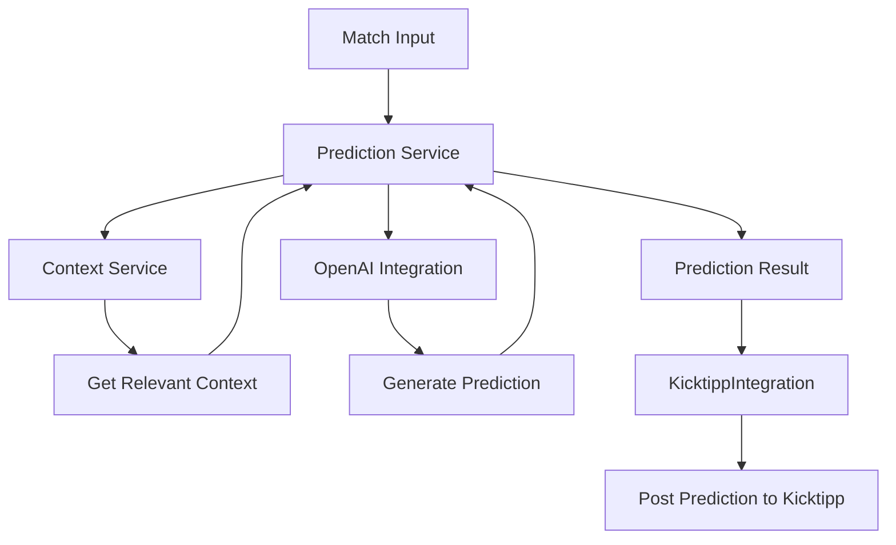

# Predict One Match - System Diagram

```mermaid
graph TD
    A[Match Input] --> B[Prediction Service]
    B --> C[Context Service]
    C --> D[Get Relevant Context]
    D --> B
    B --> E[OpenAI Integration]
    E --> F[Generate Prediction]
    F --> B
    B --> G[Prediction Result]
    G --> H[KicktippIntegration]
    H --> I[Post Prediction to Kicktipp]
```
